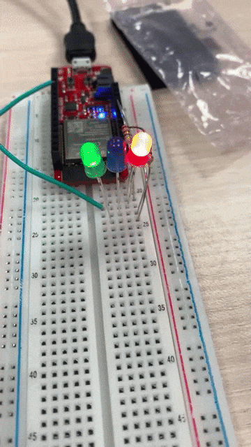
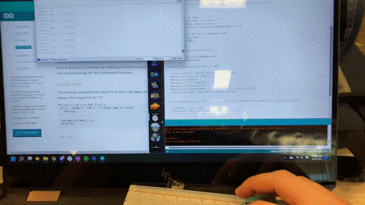

[//]: <> (Titles)

# README Lab 2

[//]: <> (Name and ID)

## Name and ID

Zachary Cadieux A15912942

[//]: <> (Lab 1 Content)

## Tutorial 1 - Arduino Setup

The first tutorial led me through setting up the Arduino, getting the firmware ready, and downloading the necessary drivers. Dealing with the drivers was interesting because I already had my computer set up for a different Arduino, so I had to change all my settings. 

## Tutorial 2 - Digital Communication
This tutorial primarily consisted of building example circuits, and running example code to test examples of digital communication between the Arduino and inputs and outputs such as a button and an LED. The topics here were used in the Challenges, as each challenge required code and circuits similar to the ones used here to set up the light blinking and stopwatch/timer. 

## Tutorial 3 - Serial Communication
Communicating through serial was the focus of this tutorial, using the Serial Monitor to input values and get outputs. This came up again in Challenges 2 and 3, which both needed to write to the Serial Monitor as part of the solution. This tutorial was pretty straightforward for me, since I was using an Arduino for Serial communication like this in another class as well.

## Challenge 1
Part 1 had us blink three LEDs at specific frequencies. To do this, I used the code from Tutorial 2 that blinked an LED as a template, copying it three times and changing the variables to have different on and off times for each color. To find how long the times should be, I took 1/frequency as the period, and then converted this into milliseconds, setting the on period and off period variables to this value. 

To do part 2, all I needed to do was change the times that each light was on or off for, all the rest of the code stayed identical. 

### Part 1

### Part 2

## Challenge 2
This challenge required using the Serial Monitor from tutorial 3. The initial set up was simple, creating a boolean that was toggled when the button was released, or changed from HIGH to LOW. Then, when this boolean was true, the counter would increment every time a second passed, pausing when the boolean is toggled back to false by another press of the button. In my code I put an additional print statement to print the state of the boolean, 1 for true and 0 for false, to help with debouncing and troubleshooting, since it was difficult to see if it was counting or not since it only updated when a full second had passed. It was also important to add a small delay to debounce the button, since without that it would sometimes not toggle properly on a press.

## Challenge 3
To do this challenge, I started with my code from Challenge 2 and used a boolean to track if the timer was counting down or not. Pressing the button logged the time and increased the timer count. If it had been three seconds since that logged time, then the boolean gets set to counting down, making the if statements true so code was activated to count down the timer every second. As with Challenge 2, debouncing was important to get the proper behavior here, and I used similar print statements to verify the condition of the boolean, and that the timer was getting incremented appropriately without skipping parts of the code, which was an error I was having early in my process.

