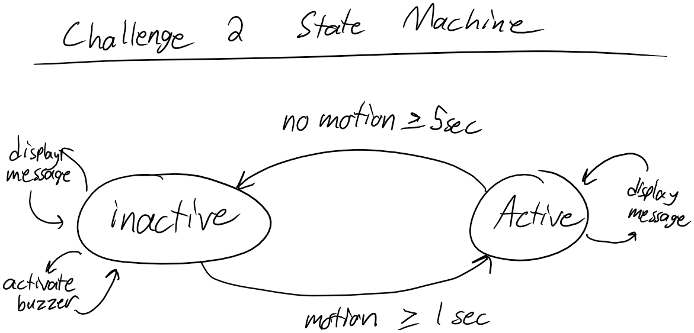

[//]: <> (Titles)

# README Lab 3

[//]: <> (Name and ID)

## Name and ID

Zachary Cadieux A15912942

[//]: <> (Lab 1 Content)

## Tutorial 1 - Object-Oriented Python

The first part of this tutorial included a simple example class, and served as an easy example of how to construct objects and access data within them. The second part implemented some modules into a package that was used in the later tutorials and challenges, which is extremely useful for simplifying the code structure. The **ECE16Lib** folder contains files for Communication, and adds in CircularList and IdleDetector later in the lab. 

**When edits are made to **ECE16Lib**, it must be reinstalled with pip.**

### Questions

> 1) The print(scout) statement gives the memory location of the Dog object within working memory, which is used to reference the object.
> 2) The code returns: AttributeError: 'Dog' object has no attribute '__breed', indicating that the variable is unable to be accessed directly, as we'd expect from the double underscore in front. This means that it must be accessed via helper functions, which is good for OOP because we can limit the cases in which specific variables are used or changed.
> 3) See code for solution

## Tutorial 2 - Python Plotting

This tutorial contained the basics of plotting in Python, with easy reference examples of simple graphs and labels. The second part of the tutorial implements the first part plotting accelerometer data, which then is built upon in tutorial 3 and the challenges. 

## Tutorial 3 - Live Plotting

This tutorial was a cool way to see live data outputs from the accelerometer, which is heavily used in the challenges. The addition of CircularList is a very helpful module for ECE16Lib, as it is an important tool for managing live data. 

## Challenge 1

The concept for this challenge was to measure the values on the accelerometer, and use the format from tutorial 3 to live plot the data, as well as transformations of the data. While the calculations themselves and the formatting of the code was relatively simple, since it very closely followed the model from Tutorial 3, I ran into issues with the performance of my code, and ended up with latency in certain situations that made my plots lag almost half a minute behind the real world. I resolved this by adjusting the refresh and pause times, as well as by only graphing a few values at a time, rather than all 8 values at once. Below are all my plots, with the raw data visible in each (x, y, and z plotted on the same graph), average_x and delta_x in the first one, L2 and L1 in the second, and my own transformation in the third. For my transformation I chose to plot a normalization of x, taking the current x value divided by L2. 

Note that in the gifs provided I have the board plugged into my computer, I had misplaced my battery so I did this under computer power, still using bluetooth. 

## Challenge 2

This challenge built on challenge 1, using the live plotting algorithm along with the transformations to build an algorithm to detect if the accelerometer has been idle for a certain amount of time. Before writing my code, I drew a state machine of the system. While it only has two states, the conditions for switching between states are a bit complex. After drawing up the state machine, I worked on identifying a suitable condition for determining if the accelerometer was active or inactive.

I ended up using `abs(L2[-1]-L2_avg[-1]) > cutoff` as my condition, where L2[-1] is the L2 norm of the current data, and L2_avg[-1] is the average of the L2 norms across the past 2 seconds of data. This gives a good indication of motion, since it picks up motion in any axis, without using a hard threshold. The cutoff used took some tuning, I ended up using 40 since the buzzer added some noise to the measurement that could accidentally make it think it was moving when it wasn't, so I needed a relatively high threshold.

Once I had determined these two factors, I began coding up my solution, setting up the proper conditions. I ran into some serial issues, but after spending some time tuning my timings and troubleshooting, I was able to smooth it out. 

## Challenge 3

This challenge primarily involved reorganizing my challenge 2 code, keeping the same logic but just restructuring it into new methods and changing the variable definitions to be internal. This was relatively simple, the most complicated part was ensuring that I was using the proper instances of variables, and making sure my indentation was correct when copy and pasting from my Challenge 2. Note the noisy data on the graph from the buzzer that I mentioned in Challenge 2.

