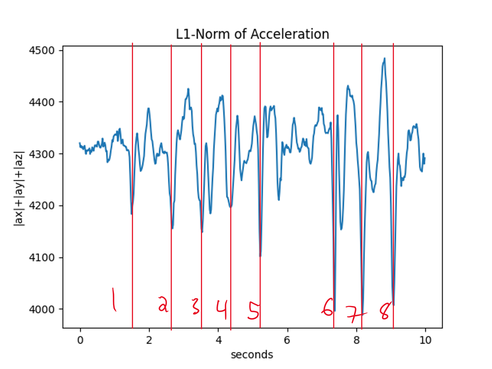

[//]: <> (Titles)

# README Lab 5

[//]: <> (Name and ID)

## Name and ID

Zachary Cadieux A15912942

Lab Partner: Gillian McMahon

[//]: <> (Lab 1 Content)

## Tutorial 1 - Offline Data Analysis

The first couple parts of this tutorial involve running some example code, to practice various methods of writing and reading information to and from data files. Running the tutorial_file_io.py program shows the peaks on the acceleration graph, as I took steps holding it. In the below graph, I marked the spikes where my steps occured. Other example data and images are located in the **data** and **images** folders, respectively. 

## Tutorial 2 - Digital Signal Processing (DSP)

This tutorial contained instructions for data filtering and processing, along with the necessary code to add to ECE16Lib to do this in tutorial 2, 3, and the challenges. Using the various techniques on the sample data gave a good indication of different ways of processing the data to give different interpretations and understandings of how to view the data. After looking at each of these methods, we put them together into DSP.py, a module of functions in ECE16Lib, to package it up for easy future use.

## Tutorial 3 - Pedometer Class

This tutorial led us through creating the Pedometer class, and using it to analyze data both on and offline, which is applicable in both challenges. To implement the process() method, I used the process from tutorial_dsp_module.py (tutorial 2) as a model. This worked well for the offline analysis, since it needed the same thresholds to effectively analyze that dataset. Then, for the online data analysis, I was able to use the provided script, along with some simply modification of the thresholds via trial and error to get upper and lower bounds for my step counts. 

## Challenge 1

This challenge essentially took the code from Tutorial 3, and then improved it to the point where we were able to get an accurate count of the number of steps that we took. In order to display the data, we had Python send the number of steps over bluetooth every time the data was processed. In order to fine tune the data processing, we changed four parameters in the pedometer class. We changed the cutoff frequency for the lowpass filter to 2 instead of 1, which makes it so the filter passes more data, including slightly higher frequency data. We also adjusted the number of values included in the moving average, to take in less samples and therefore smooth out the data less so spikes would be more visible. Finally, we doubled the number of samples, so we had more data to work with, and simultaneously halved the process time to increase the sensitivity of the pedometer. 

## Challenge 2

This challenge's primary hardship was in dealing with communicating the large amount of data from the Arduino to Python. Originally my partner and I attempted to send the data all at once, in one long string, however we found that was impractical due to limitations on the baud rate of the Arduino, it cut off the string at certain points which caused messy errors in trying to save the data. We ended up using a loop on both ends, on the Arduino to send the array of data as many messages, and on Python to keep receiving until all data in inputted, initially putting it in an array and then adding it to the Pedometer object to process it all at once. 

We identified that jumps had peaks that were just over the upper threshold of our steps, so we were able to use our step upper bound as our jump lower bound. This required minor modifications to the Pedometer class, to take in and return the extra values. We also increased our baud rate, in an attempt to increase the speed of reading in the data from the Arduino to increase its responsiveness. Below is a video of it in action, in which I jump, and then take two steps, which is accurately displayed on both the LCD and the Python plot.

