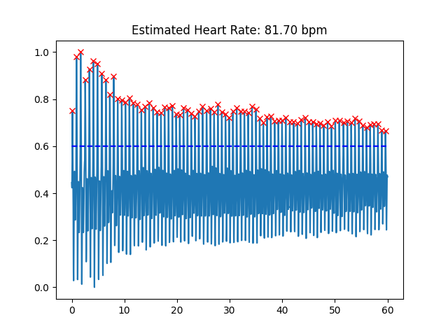
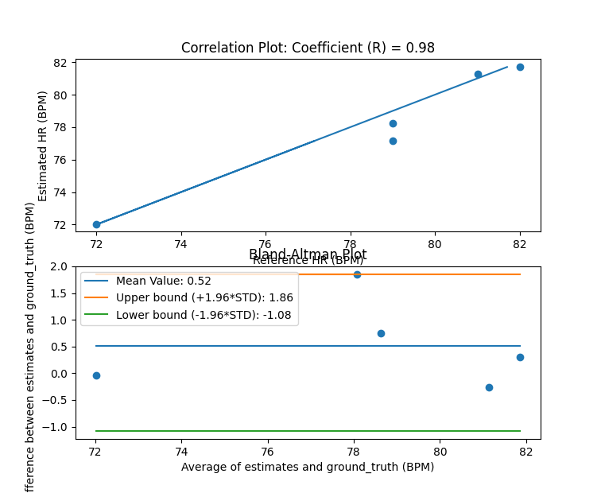
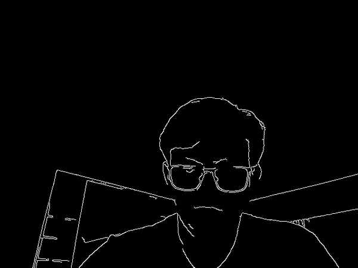
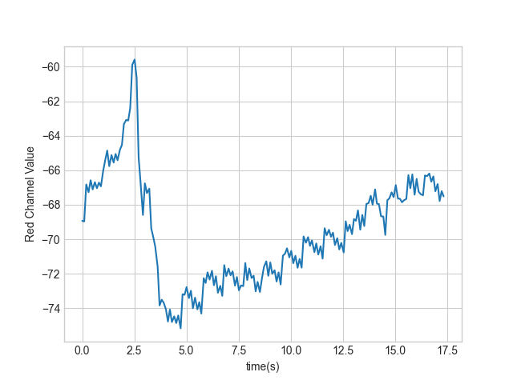

[//]: <> (Titles)

# README Lab 6

[//]: <> (Name and ID)

## Name and ID

Zachary Cadieux A15912942

[//]: <> (Lab Content)

## Tutorial 1 - Offline Data Analysis

This tutorial gave an introduction to Photoplethysmography (PPG), and using the photosensor module effectively, as it is a key component for the rest of lab 6. Note that the datasheet (https://cdn.sparkfun.com/assets/8/1/c/9/0/MAX30101_Datasheet.pdf) is very useful for adjusting sensor values if needed.

Tutorial 1 questions:

1. This works because the sensor is something that is read from, while the OLED is written to, so they should be able to use the same wires to communicate since all readings will be from the heartbeat sensor and all writing will be to the OLED.

2. The while(1) statement makes it such that if the device is not connected, the Arduino will not exit setup, looping continuously in that location with the error as the last thing printed. If the error is printed and the device connected, the code will not proceed until the Arduino is reset.

3. 

``` C++
//Setup for given values
byte ledBrightness = 0x19; //Options: 0=Off to 255=50mA
byte sampleAverage = 8; //Options: 1, 2, 4, 8, 16, 32
byte ledMode = 2; //Options: 1 = Red only, 2 = Red+IR, 3 = Red+IR+Green
int sampleRate = 200; //Options: 50, 100, 200, 400, 800, 1000, 1600, 3200
int pulseWidth = 411; //Options: 69, 118, 215, 411
int adcRange = 8192; //Options: 2048, 4096, 8192, 16384
```

4. Hz, a bigger pulse would result in a more intense measurement because it is interpreted by PWM as a larger command signal.

5. 14

6. Red: 670 nm, IR: 900 nm, Green: 545 nm

## Tutorial 2 - PPG Filtering and Class

This tutorial introduces data filtering with PPG data to get accurate heart rate counts. The method used to filter the data is very similar to the step counter filtering, and is able to give a very good estimation of heart rate by identifying peaks. This filtering is done using offline data, to be applied later both on and off line. 

Estimated rate: 74.37 bpm

## Tutorial 3 - Data Collection for ML

This tutorial involved running a predefined script to collect data for machine learning in later labs. After the first couple attempts to ensure that I was collecting useful data, it was simple to run the script and collect the appropriate data, which has been uploaded to the class google drive as well as contained within the data folder for this lab. 

## Challenge 1 - Heuristic Heart Rate Monitor and Evaluation

Overall, the algorithm presented in tutorial 2 was extremely effective, starting at about a 96 percent correlation with no edits at all. However, in some samples there were lower peaks being counted when they should not have been, but moving the lower threshold up would cut off some peaks that should have been counted, unless the changes were very precise, which would not have been consistent for later samples. Instead, I tweaked the values on the moving average and detrend commands, making the peaks slightly more pronounced in order to make the spikes more obvious. This was possible because the photosensor has a relatively high accuracy, so there is not much noise in the initial measurements, and the heartbeats make a pretty significant jump in the measured values. Below is an example of one of the filtered data sets:



Once I tweaked some of the values, I ran the given Bland-Altman algorithm, generating the following correlation and BA plot:



Due to the closeness of the data, getting a higher correlation coefficient was very difficult, however upon visual inspection of the raw and filtered data, it was very nearly accurate, with small inaccuracies due to cutoffs at the beginning and end of data collection, or because of rounding in the bpm measurements.

## Challenge 2 - Online Heart Rate Monitor

Making this online monitor involved taking the code from Challenge 1, as well as the online pedometer code from Lab 5 to combine them together into a live script for the photosensor. Overall it was pretty straight forward, with some hiccups in the time scaling and in getting good connections on the wires of the photosensor. 

[](https://youtu.be/Ied1IuMM3wM "Lab 6 Challenge 2")

## Challenge 3 - OpenCV Heart Rate Monitor

OpenCV posed some challenges, specifically with saving video for the edge detection demonstration. With the help of others on the slack, I was able to find a work around by using an MP4 codec instead of the given AVI codec. Below is an example of my edge detection script at work:



After that, I was able to start on the heartbeat sensing, which involved taking my tutorial 2 code and simply changing the input source. I had some hiccups in my bluetooth communications here, and in the ports for the OLED and photosensor, but after some troubleshooting it worked reasonably well. The measurements with my webcam were far less accurate than the photosensor, primarly due to the poor quality of my webcam but also it was much easier for my finger to slide out of the FOV of the camera, since my laptop webcam is flush with the rest of the screen. Below is an example of the heartbeat plot from the tutorial portion of this challenge: 



Note the spike at the beginning is from adjusting my finger to move into place. Finally, below is the video of my functional webcam HR monitor:

[](https://youtu.be/dR2NHeoIrRI "Lab 6 Challenge 3")

Questions:
- The sampling rate is 10 samples/s. Across multiple trials of about 15 seconds each, it consistantly falls at this rate. In the example graph I have 17 samples over 17 seconds, giving a heart rate of approximately 60 bpm. 