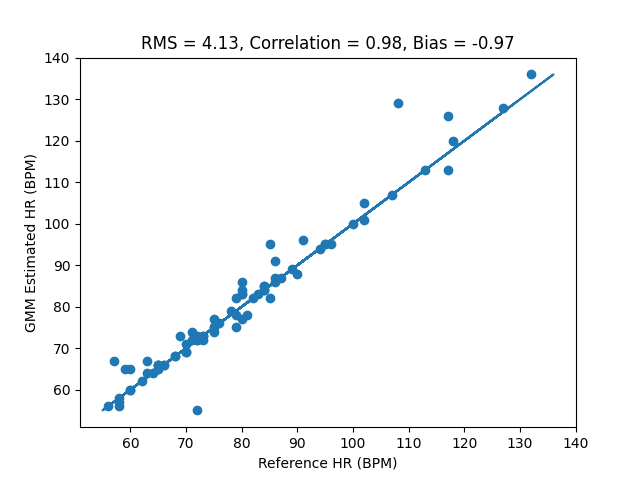

[//]: <> (Titles)

# README Lab 7

[//]: <> (Name and ID)

## Name and ID

Zachary Cadieux A15912942

[//]: <> (Lab Content)

## Tutorial 1 - ML Data Preparation

This tutorial goes over using the files with the heartbeat data from the other people in the class, and verifying that all the files are filled with usable data as well as getting familiar with the glob utility. This took some time to go through each, but I was able to match my results to what other people in the Slack were noting about issues with people's files.

## Tutorial 2 - GMM HR Monitor

This tutorial goes over the does and don'ts with using the GMM, and sets up the initial code for using it to estimate heart rate using leave one subject out validation to validate the results. This goes with the idea of making sure not to validate on the same data that was used to train it.

## Challenge 1 - GMM Performance

For this challenge we used the LOSOV method from Tutorial 2 to estimate the heart rates from the given data for every file in the class drive, as well as computing statistics to verify the accuracy of the data. Below is the graph of the data, as well as the values of the root mean square error, correlation, and bias.

RMSE is valuable because it gives a standard metric for error that accounts purely for deviation from the true value, rather than possibly being offset by directional error, and by taking the square root it provides it on a scale that is directly applicable to the actual values, telling us that in this case our standard error is about 4 off from the ground truth. Correlation is also an important factor because it gives an idea of how well our predictions and the real values have matching trends, and bias tells us if we're significantly offset either above or below the true values. I chose these to help me eliminate bad values and pick out which data points I needed to check, since I could see how including or excluding certain data could effect the correlation, and bias helped ensure we weren't systematically over or under estimating the real values.

## Challenge 2 - Online Heart Rate Monitor

## Challenge 3 - OpenCV Heart Rate Monitor

